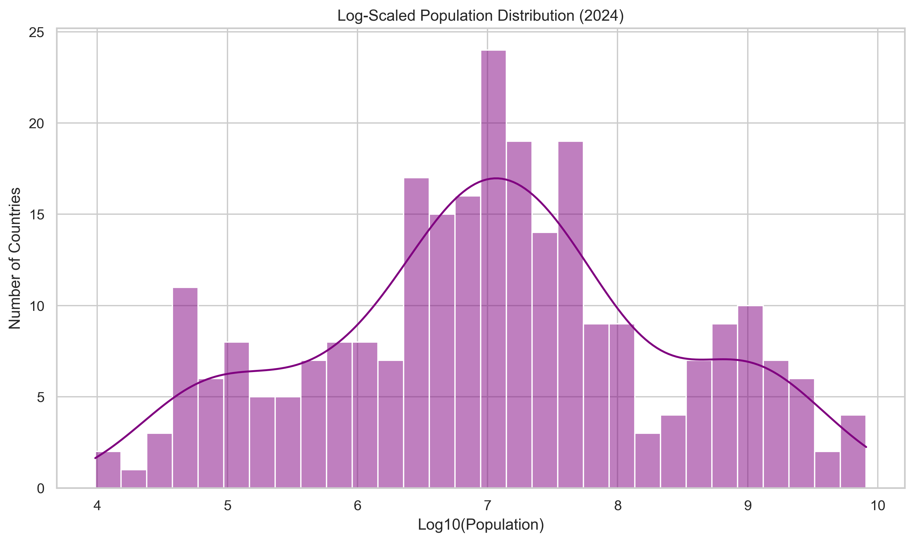

# Task 1 - Population Distribution Visualization | Prodigy Infotech Internship (Data Science)

This repository contains my submission for **Task 1** of the **Data Science Internship** at **Prodigy Infotech**.

---

## Task Description

> **Create a bar chart or histogram to visualize the distribution of a categorical or continuous variable, such as the distribution of ages or genders in a population.**

---

## Dataset Used

- **Source:** [World Bank - Total Population (SP.POP.TOTL)](https://data.worldbank.org/indicator/SP.POP.TOTL)
- **File:** `API_SP.POP.TOTL_DS2_en_csv_v2_20333.csv`
- **Details:** This dataset includes total population figures for all countries from **1960 to 2024**.

---

## Objective

To visualize how the **population of countries is distributed** in the most recent year (**2024**) using:
- A **histogram** for all countries
- A **log-transformed histogram** to better handle extreme values and skewness

---

## Tools & Libraries

- Python 
- Pandas 
- Seaborn 
- Matplotlib 
- Jupyter Notebook 

---

## Visualizations

### Histogram (Log-Scaled) – 2024 Population Distribution

  

**Observation:**
- The population data is **right-skewed** due to large outliers like India and China.
- Most countries have populations in the range of **1 to 100 million**.
- A **log10 transformation** provides a clearer view of the global population spread.

---

